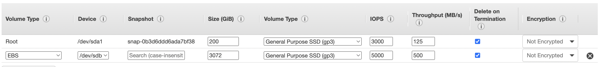
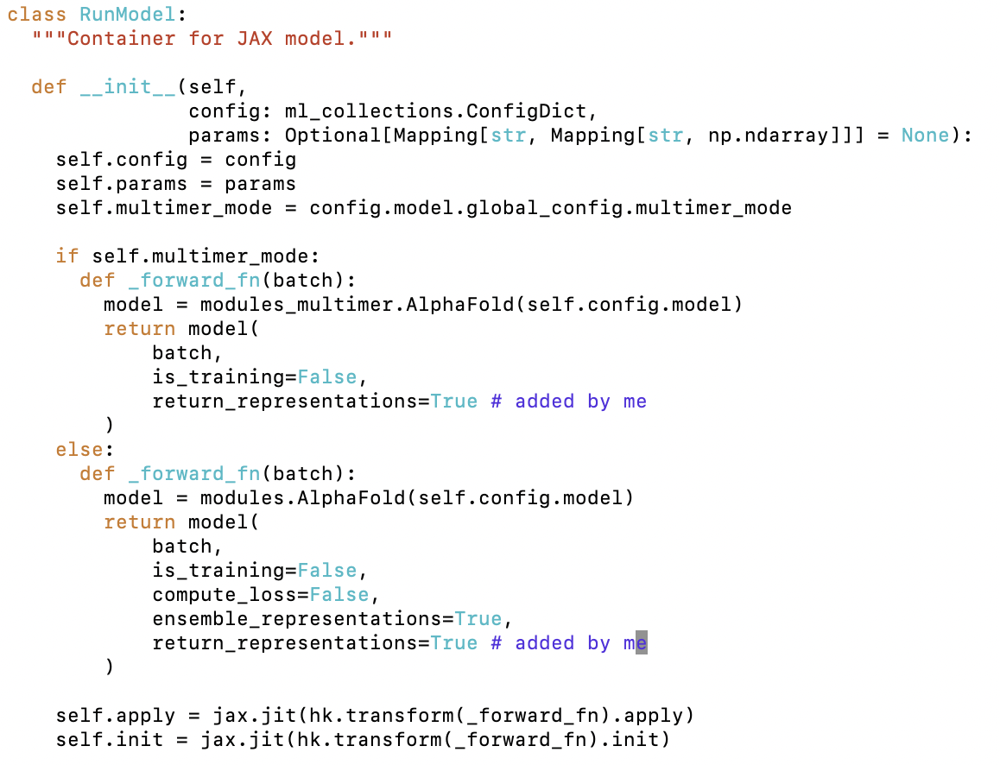

# alphafold2 installation on EC2

The following is a step-by-step guide to install the original [alphafold2](https://github.com/deepmind/alphafold) on an EC2 instance. I would lke to thank the [Chinese Antibody Society](https://chineseantibody.org/) for providing the computation resources and support for this project. 

The guide covers: 
1. start from a blank Ubuntu instance
2. install nvidia driver and dockers 
3. install alphafold 2
4. modify code to return embeddings from alphafold 2
5. how to download the database if your firewall does not allow FTP
6. example of usage
7. example of analysis 


# Step 1: Instance Setup

## EC2 instance creation

1. On AWS, create a EC2 instance with: 

   - **Ubuntu 20** image
   - **p3.2xlarge** instance type.
   - set root volume to 200G
   - Create a secondary volme of **3T (3072 GB)** EBS 
   

2. Launch the instance

## Create EFS for user data 

When embeddings are returned, results files are generally large, and EFS storage is recommended as it dynamically expands. EFS is simple to create by following the [guide](https://docs.aws.amazon.com/efs/latest/ug/gs-step-two-create-efs-resources.html). The steps involve:

1. Create a EFS volume
2. Click on "Attach" and select "HTTPS" for mounting option. Copy the mounting command. 
3. return to EC2 instance and attach the EFS volume to the instance.
```shell
cd /
mkdir efs
paste_the_mounting_command_and_run
```
if you name the folder other than `efs`, be sure to change the `efs` in the mounting command to the name you chose.


## CUDA installation

### Install CUDA

1. update

   ```
   sudo apt update
   ```

2. Install the toolkit

   ```
   sudo apt install nvidia-cuda-toolkit
   ```

   This might take a while to run. 

3. Verify the installation 

   ```
   nvcc --version
   ```

   Output should be similar to:

   ```
   nvcc: NVIDIA (R) Cuda compiler driver
   Copyright (c) 2005-2019 NVIDIA Corporation
   Built on Sun_Jul_28_19:07:16_PDT_2019
   Cuda compilation tools, release 10.1, V10.1.243
   ```

4. Right now likely you still dont’ have GCC, so compilation will not work. 

### Install GCC

1. In the EC2 terminal, run

   ```
   sudo apt install build-essential
   ```

   The command installs a lot of packages, including `gcc`, `g++` and `make`.

2. Install the manual pages about using GNU/Linux for development

   ```
   sudo apt-get install manpages-dev
   ```

3. Verify gcc is installed, by typing:

   ```
   gcc --version
   ```

   Output should be similar to below:

   ```
   gcc (Ubuntu 9.4.0-1ubuntu1~20.04.1) 9.4.0
   Copyright (C) 2019 Free Software Foundation, Inc.
   This is free software; see the source for copying conditions.  There is NO
   warranty; not even for MERCHANTABILITY or FITNESS FOR A PARTICULAR PURPOSE.
   ```

### Test exmaple code

There are 2 example codes that you can test:

#### Test gcc

1. Linux terminal, create a file:

   ```
   cd ~
   nano hello.c
   ```

   Copy the contents into this file

   ```c
   // hello.c
   #include <stdio.h>
    
   int main() {
       printf("Hello, world!\n");
       return 0;
   }
   ```

2. Save the file with `ctrl+O` (NOT `cmd` even if you're on mac). Then press Enter, and exit with `ctrl+X` . 

3. compile it with:

   ```
   sudo gcc hello.c -o hello
   ```

   This creates a **binary file named hello** in the same directory where you run the command.

4. Execute the **hello bin file** with:

   ```
   ./hello
   ```

   OUTPUT:

   ```
   Hello World!
   ```

5. Done!

#### Test cuda

1. Create a file:

   ```
   sudo nano hello.cu
   ```

   Note that the extension this time is **.cu ** NOT **.c**

   Copy contents into this file:

   ```c
   #include <stdio.h>
   
   __global__
   void saxpy(int n, float a, float *x, float *y)
   {
     int i = blockIdx.x*blockDim.x + threadIdx.x;
     if (i < n) y[i] = a*x[i] + y[i];
   }
   
   int main(void)
   {
     int N = 1<<20;
     float *x, *y, *d_x, *d_y;
     x = (float*)malloc(N*sizeof(float));
     y = (float*)malloc(N*sizeof(float));
   
     cudaMalloc(&d_x, N*sizeof(float)); 
     cudaMalloc(&d_y, N*sizeof(float));
   
     for (int i = 0; i < N; i++) {
       x[i] = 1.0f;
       y[i] = 2.0f;
     }
   
     cudaMemcpy(d_x, x, N*sizeof(float), cudaMemcpyHostToDevice);
     cudaMemcpy(d_y, y, N*sizeof(float), cudaMemcpyHostToDevice);
   
     // Perform SAXPY on 1M elements
     saxpy<<<(N+255)/256, 256>>>(N, 2.0f, d_x, d_y);
   
     cudaMemcpy(y, d_y, N*sizeof(float), cudaMemcpyDeviceToHost);
   
     float maxError = 0.0f;
     for (int i = 0; i < N; i++)
       maxError = max(maxError, abs(y[i]-4.0f));
     printf("Max error: %f\n", maxError);
   
     cudaFree(d_x);
     cudaFree(d_y);
     free(x);
     free(y);
   }
   ```

2. Next, use the Nvidia CUDA compiler to compile the code into **a bin file**

   ```
   nvcc -o hello hello.cu 
   ```

3. Execute the **bin file**

   ```
   ./hello 
   ```

   Output should be similar to below:

   ```
   Max error: 0.000000
   ```

   The actual value for max error doesn't need to be 0.0000. 


## Install Miniconda

1. Install miniconda

   ```
   wget https://repo.continuum.io/miniconda/Miniconda3-latest-Linux-x86_64.sh -O ~/miniconda.sh 
   bash ~/miniconda.sh -b -p ~/miniconda 
   echo "PATH=$PATH:$HOME/miniconda/bin" >> ~/.bashrc 
   source ~/.bashrc
   ```

2. Create conda environment, say

   ```
   conda create --name pytorch python=3.9
   ```

   We will use pytorch to test CUDA drivers

3. Activate env

   ```
   source activate pytorch
   ```

4. Install jupyter lab

   ```
   conda install jupyterlab
   ```

5. First check your cuda version

   ```
   nvidia-smi
   ```

6. Then go to https://pytorch.org/get-started/locally/ , select the **Stable, Linux, PIP, Python, Cuda(closest match of your version)**. Copy the command and install.

   > - use `pip` NOT `conda`

   For example, my Cuda compilation tool is 12.0, but I installed pytorch with CUDA 11.6 platform 

7. To check that cuda has been properly enable:

   Open up a Python terminal (no need to go into jupyter notebook):

   ```
   python
   ```

   Type: 

   ```
   import torch
   torch.cuda.is_available() 
   ```

   If the result is `False`, you still need to install appropriate drivers. Continue with next steps. 

## Install NVIDIA drivers

### Installation

1. Check [reference](https://docs.nvidia.com/datacenter/tesla/tesla-installation-notes/index.html#package-manager) here. Scroll down to the **Package Manager** section, and look into the **Ubuntu LTS** part. This is the only place you need to look at. 

   > The steps under **Ubuntu LTS** applies to Ubuntu 22.04 LTS as well.  

2. Install Linux headers

   ```
   sudo apt-get install linux-headers-$(uname -r)
   ```

3. Get distribution

   ```
   distribution=$(. /etc/os-release;echo $ID$VERSION_ID | sed -e 's/\.//g')
   ```

   The command above automatically obtains distribution and store it in the `distribution` variable. 

4. Install keyring

   ```
   wget https://developer.download.nvidia.com/compute/cuda/repos/$distribution/x86_64/cuda-keyring_1.0-1_all.deb
   ```

   Note that the link above we have:

   - `$distribution$`: we automatically extracts the distribution variable
   - `x86_64`: this is the platform of the EC2 instance when you created it. If you follow this guide you're using x86 not arm. If you use other platform check the "CUDA key ring" section in this note for a different link. 

5. Install keyring

   ```
   sudo dpkg -i cuda-keyring_1.0-1_all.deb
   ```

   There might be some warning message saying key expired and ask you to remove it. Ignore it. 

6. Update apt

   ```
   sudo apt-get update
   sudo apt-get -y install cuda-drivers
   ```

7. You must proceed to the post-installation step. 

### Post-installation

1. Check out [this page](https://docs.nvidia.com/cuda/cuda-installation-guide-linux/index.html#post-installation-actions) for reference. The only section you need to look at is **"Mandatory Actions"**. I copied them below

2. Check your cuda version by running:

   ```
   nvidia-smi 
   ```

   It should show somethign like this at the top of the table: 

   ```
   CUDA Version: 12.0 
   ```

3. Type

   ```
   export PATH=/usr/local/cuda-12.0/bin${PATH:+:${PATH}}
   ```

   - Replace `12.0` with your cuda version: 

   Then type: 

   ```
   export LD_LIBRARY_PATH=/usr/local/cuda-12.0/lib64\
                            ${LD_LIBRARY_PATH:+:${LD_LIBRARY_PATH}}
   ```

   - Replace `<version>` with your cuda version

4. Set up Power9

   ```
   sudo systemctl enable nvidia-persistenced
   ```

5. Check the hotadd memory rules

   ```
   cd /lib/udev/rules.d
   ```

   When `ls` in this directory, you should see a bunch of rules. Type

   ```
   vim 40-vm-hotadd.rules
   ```

   In side this file, y ou should see something like this: 

   ```
   # Memory hotadd request
   SUBSYSTEM=="memory", ACTION=="add", DEVPATH=="/devices/system/memory/memory[0-9]*", TEST=="state", ATTR{state}!="online", ATTR{state}="online"
   ```

   This is where you nee to change, but not on this file. 

   For now, simply quit vim (`:q`), and continue with the next steps. 

6. Create a copy of the rule file above at `/etc/udev/rules.d` :

   ```
   sudo cp /lib/udev/rules.d/40-vm-hotadd.rules /etc/udev/rules.d
   ```

7. cd into the location of the copy

   ```
   cd /etc/udev/rules.d
   ```

   Use `ls` and you should see a file called `40-vm-hotadd.rules`. This is the file we need to modify. 

8. Make sure you're in `/etc/udev/rules.d` directory, then type: 

   ```
   sudo vim 40-vm-hotadd.rules
   ```

   > must use `sudo` because this is a read-only file

9. Comment out the line with starting with `SUBSYSTEM ==`....like this: 

   ```python
   # Memory hotadd request # COMMENT THIS OUT!!!
   # SUBSYSTEM=="memory", ACTION=="add", DEVPATH=="/devices/system/memory/memory[0-9]*", TEST=="state", ATTR{state}!="online", ATTR{state}="online"
   ```

   Save with  `:wq!` 

10. Vim into the file to confirm the changes have been made. 

11. Stop the running instance, and reboot it to initialize the above changes. 

## Checking CUDA

In terminal, type: 

```
conda activate <your env where pytorch is installed>
python
import torch
torch.cuda.is_available()
```

Should say `True`.

# Step 2: Download Data

## How AF database download works

You can see a list of databases that ALphaFold is trying to download [here](https://github.com/deepmind/alphafold/blob/main/scripts/download_all_data.sh). You can download each database individually using commands like: 

```
/data/alphafold/scripts/download_pdb_seqres.sh /data/af_download_data
```

Alternatively, you can download all data at once using: 

```
/data/alphafold/scripts/download_all_data.sh /data/af_download_data
```

The download all data approach will fail if your organization blocks all FTP protocols. We will discuss how to get around that in the troubleshooting section.

## Download data

1. If you have not done so already, mount `/data` drive: 

   ```shell
   lslblk 
   ```
   Check the name of the your volume that has 3T space. Assume it's called `xvdk`. 

   Create a folder called `/data` in the root directory
   ```shell
   mkdir /data
   ```  

   Then mount it:
   ```
   sudo mount /dev/xvdk /data
   ```

   You should be able to use

   ```
   cd /data
   ```
   if you mounted it correctly

2. Install the AlphaFold dependencies and any other required tools:

   ```
   sudo apt install aria2 rsync git vim wget tmux tree -y
   ```

3. Create working folders, and clone the AlphaFold code from the GitHub repo:

   ```
   cd /data
   mkdir -p /data/af_download_data
   mkdir -p /data/output/alphafold
   mkdir -p /data/input
   git clone https://github.com/deepmind/alphafold.git
   ```

   This generates 3 folders: 

   - `af_download_data`: stores database
   - `input`: input sequence
   - `output/alphafold`: stores model predictions

5. Start a tmux session.

   ```
   tmux
   ```

6. Download the data using the provided scripts. AlphaFold needs multiple genetic (sequence) database and model parameters.

   ```
   /data/alphafold/scripts/download_all_data.sh /data/af_download_data
   ```

   In this case, when promtp says 

   ```
   (OK):download completed.
   ```

   Then it is completed.

   Note: 

   - I recommend this approach over nohup becuase you can see what is going on and what's wrong. 

   - `bfd/` is only downloaded if you download the full databases, and `small_bfd/` is only downloaded if you download the reduced databases.

   - If your organization blocks FTP, likely something will go wrong when you start downloading `pdb_Mmcif`. The following downloads also might not work, because they rely connection over FTP

     -  `download_pdb_mmcif.sh`

     - `download_uniref90.sh`

     - `download_uniprot`

     - `download_pdb_seqres.sh`

## Troubleshooting data download due to FTP blockage

### `download_uniref90.sh`, `download_uniprot.sh`, `download_pdb_seqres.sh`

These are relatively easy to address, because there are HTTPS download endpoints. Below you can find example of modify .sh file that invokes the HTTPs download. 

Modify `download_uniref90.sh`
```
#SOURCE_URL="ftp://ftp.uniprot.org/pub/databases/uniprot/uniref/uniref90/uniref90.fasta.gz"

SOURCE_URL="https://ftp.uniprot.org/pub/databases/uniprot/uniref/uniref90/uniref90.fasta.gz"
```

Modify `download_uniprot.sh`. 

```
#SPROT_SOURCE_URL="ftp://ftp.ebi.ac.uk/pub/databases/uniprot/current_release/knowledgebase/complete/uniprot_sprot.fasta.gz"

SPROT_SOURCE_URL="https://ftp.uniprot.org/pub/databases/uniprot/current_release/knowledgebase/complete/uniprot_sprot.fasta.gz"
```

Modify `download_pdb_seqres.sh`
```
#SOURCE_URL="ftp://ftp.wwpdb.org/pub/pdb/derived_data/pdb_seqres.txt"

SOURCE_URL="https://files.wwpdb.org/pub/pdb/derived_data/pdb_seqres.txt"
```

Run each of the three modified download files. For example: 

```
/data/alphafold/scripts/download_pdb_seqres.sh /data/af_download_data/
```

Repeat for two other files we modified above. 


###  `download_pdb_mmcif.sh`

1. Download `mmcif` database manually via a connection that allows FTP 
    ```
    mkdir pdb_mmcif
    rsync --recursive --links --perms --times --compress --info=progress2 --delete --port=33444 rsync.ebi.ac.uk::pub/databases/pdb/data/structures/divided/mmCIF/ pdb_mmcif
    ```

2. Copy the downloaded mmcif database to EC2 instance: 

   ```
   scp -i your.pem path/to/pdb_mmcif ubuntu@your_ip_address:/data/af_download_data/ -r
   ```
   see [here](https://medium.com/srcecde/copy-file-directory-to-from-ec2-using-scp-secure-copy-685c46636399) for examples of copy commands. 

3. Modify the `download_pdb_mmcif.sh ` like by commenting out the lines below.  This modified shell scripts skips the folder creation and data download parts and goes directly to post-download setup. 

    ```
    #mkdir --parents "${RAW_DIR}"
    #rsync --recursive --links --perms --times --compress --info=progress2 --delete --port=33444 rsync.ebi.ac.uk::pub/databases/pdb/data/structures/divided/mmCIF/ "${RAW_DIR}"
    ```

5. Run

   ```
   /data/alphafold/scripts/download_pdb_mmcif.sh /data/af_download_data/
   ```

## Results after complete download

If download is complete, run

```
du /data/af_download_data
```

You should see something like this: 

```
5457020 ./params
1858454332      ./bfd
125566120       ./mgnify
58687036        ./pdb70
215592000       ./uniref30
70137952        ./uniref90
109098044       ./uniprot
254715224       ./pdb_mmcif/mmcif_files
254715372       ./pdb_mmcif
239964  ./pdb_seqres
2697947840      .
```

The total size of the data downloaded is close to 2.7T. The actual size of folder might vary a bit depending on the if there are new releases of the databases. 


# Step 3: Install Docker and CUDA Docker drivers

## Optional: edit docker params

1. Update `/data/alphafold/docker/run_docker.py` to make the configuration match the local path:

   ```
   vim /data/alphafold/docker/run_docker.py
   ```

   These are parameters you can call when running `run_docker.py`. Because versions of alpha fold changes, so be sure to read the latest version on [GitHub](https://github.com/deepmind/alphafold). 

2. Edit default output dir: 

   ```python
   # require user to provide output_dir
   flags.DEFINE_string(
       'output_dir', None,
       'Path to a directory that will store the results.')
   ```

3. Edit data dir

   ```python
   # provdie default for data directory
   flags.DEFINE_string(
       'data_dir', '/data/af_download_data',
       'Path to directory with supporting data: AlphaFold parameters and genetic '
       'and template databases. Set to the target of download_all_databases.sh.')
   ```

4. Edit max template date

   ```python
   # set default value for max_template_date because we're going to make it an optional param
   flags.DEFINE_string(
       'max_template_date', '3000-01-01',
       'Maximum template release date to consider (ISO-8601 format: YYYY-MM-DD). '
       'Important if folding historical test sets.')
   ```

5. Edit model preset

   ```python
   # chagne default to None so we can make it a required param
   flags.DEFINE_enum(
       'model_preset', None, 
       ['monomer', 'monomer_casp14', 'monomer_ptm', 'multimer'],
       'Choose preset model configuration - the monomer model, the monomer model '
       'with extra ensembling, monomer model with pTM head, or multimer model')
   ```

6. Edit required parameters at the bottom of the file: 

   ```python
   flags.mark_flags_as_required([
         'fasta_paths',
         'output_dir',
         'model_preset',
     ])
   ```

## Install docker

Follow the instructions [here](https://docs.docker.com/engine/install/ubuntu/#install-using-the-repository). I copied the steps below: 

1. First check your OS requirements. For example, right now: 

   ```
   OS requirements🔗
   To install Docker Engine, you need the 64-bit version of one of these Ubuntu versions:
   
   Ubuntu Kinetic 22.10
   Ubuntu Jammy 22.04 (LTS)
   Ubuntu Focal 20.04 (LTS)
   Ubuntu Bionic 18.04 (LTS)
   ```

2. We started with a blank Ubuntu instance so there is no previous docker to uninstall. 

3. Update repo

   ```
   sudo apt-get update
   sudo apt-get install \
       ca-certificates \
       curl \
       gnupg \
       lsb-release
   ```

4. Add official key

   ```
   sudo mkdir -m 0755 -p /etc/apt/keyrings
   curl -fsSL https://download.docker.com/linux/ubuntu/gpg | sudo gpg --dearmor -o /etc/apt/keyrings/docker.gpg
   ```

5. Set up the repository

   ```
   echo \
     "deb [arch=$(dpkg --print-architecture) signed-by=/etc/apt/keyrings/docker.gpg] https://download.docker.com/linux/ubuntu \
     $(lsb_release -cs) stable" | sudo tee /etc/apt/sources.list.d/docker.list > /dev/null
   ```

6. Install the latest engine

   ```
   sudo apt-get install docker-ce docker-ce-cli containerd.io docker-buildx-plugin docker-compose-plugin
   ```

7. Verify success

   ```
   sudo docker run hello-world
   ```

   The output should contain this line: 

   ```
   Hello from Docker!
   This message shows that your installation appears to be working correctly.
   ```


## Install CUDA image

1. Check your CUDA version

   ```
   nvidia-smi
   ```

2. Check your ubuntu version

   ```
   lsb_release -a
   ```

3. There are several levels of CUDA docker builds: 

   ```
   base: Includes the CUDA runtime (cudart)
   
   runtime: Builds on the base and includes the CUDA math libraries, and NCCL. A runtime image that also includes cuDNN is available.
   
   devel: Builds on the runtime and includes headers, development tools for building CUDA images. These images are particularly useful for multi-stage builds.
   ```

   It seems that the `base` version will be sufficient for AlphaFold. But we will use the `devel` here in case we need some functionality in the future. 

4. Go to https://hub.docker.com/r/nvidia/cuda, find your CUDA version (for example, 12.0), then navigate to your correct unbuntu verions beneath it.

5. Run command

   ```
   docker pull nvidia/cuda:12.0.1-devel-ubuntu20.04
   ```

   Replace `12.0.1-devel-ubuntu20.04` with your version specific tag. 

6. Check that the image is installed 

   ```
   docker images
   ```
## Install CUDA docker driver

Ref: see [here](https://gist.github.com/nathzi1505/d2aab27ff93a3a9d82dada1336c45041) and [here]( https://www.celantur.com/blog/run-cuda-in-docker-on-linux/) 

1. Run the following command, line by line: 

   ```
   sudo apt install curl
   ```

   ```
   distribution=$(. /etc/os-release;echo $ID$VERSION_ID)
   ```

   ```
   curl -s -L https://nvidia.github.io/nvidia-docker/gpgkey | sudo apt-key add -
   ```

   ```
   curl -s -L https://nvidia.github.io/nvidia-docker/$distribution/nvidia-docker.list | sudo tee /etc/apt/sources.list.d/nvidia-docker.list
   ```

   ```
   sudo apt-get update && sudo apt-get install -y nvidia-container-toolkit
   ```

   ```
   sudo systemctl restart docker
   ```

   

2. Confirm the docker container runs correctly:

```
sudo docker run --gpus all nvidia/cuda:12.0.1-devel-ubuntu20.04 nvidia-smi
```

# Step 4: Build AlphaFold image

## Recommended: make model return representations

This is required if you want to do feature extraction. I made this change by default. We can return the  representations from AlphaFold model by setting `return_representations=True` (see [GitHub issue here](https://github.com/deepmind/alphafold/issues/15)  and [here](https://github.com/deepmind/alphafold/issues/420))

Edit `/data/alphafold/alphafold/model/model.py:` as shown below: 



Once edited, in `run_alphafold.py`, this line

```
prediction_result = model_runner.predict(processed_feature_dict,
random_seed=model_random_seed)
```

should then return representations. 

## 
## Build image

1. Build the AlphaFold Docker image. Make sure you cd into `/data/alphafold` because a `.dockerignore` file is under that folder. Otherwise docker will try to upload everything!

   ```
   cd /data/alphafold
   docker build -f docker/Dockerfile -t alphafold .
   ```

   If built is successful, the last line is: 

   ```
    => => naming to docker.io/library/alphafold 
   ```

2. Confirm that docker is built, try this command

   ```
   docker images
   ```

3. Create a virtual environment

   ```
   conda create --name alphafold python=3.9
   source activate alphafold
   ```

   I keep AlphaFold in a clean environment rather than mixing it with Pytorch. 

4. Use pip to install all Python dependencies required by AlphaFold:

   ```
   pip3 install -r /data/alphafold/docker/requirements.txt
   ```

5. This is the end of setup. Continue to other notes in this repo for usage. 


