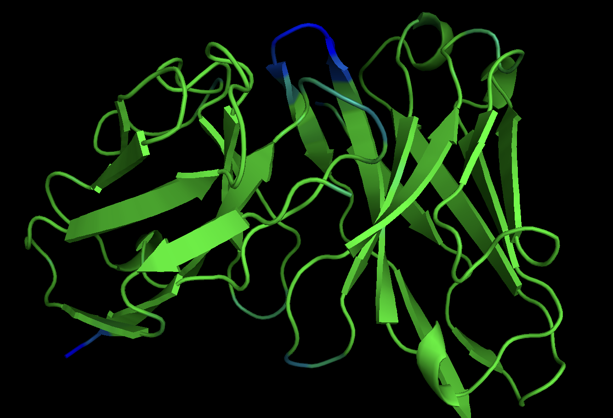
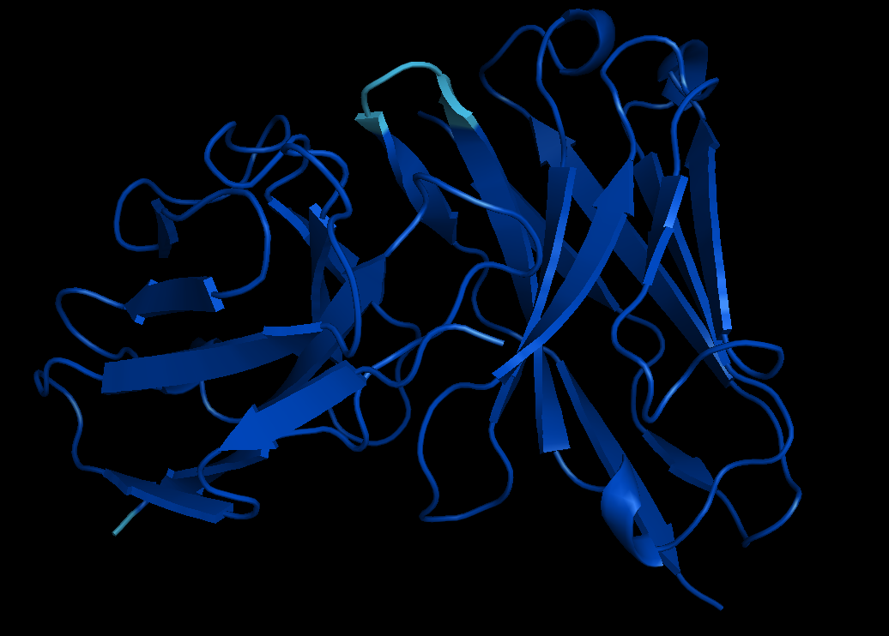
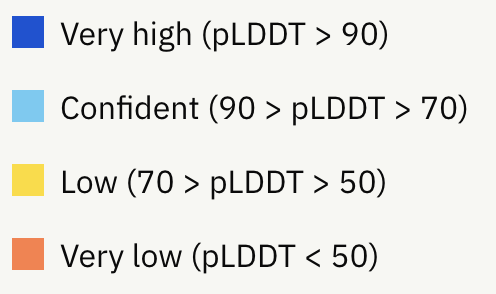

# Example analysis 


# Features.pkl

 A pickle file containing the input feature NumPy arrays used by the models to produce the structures. These features are produced post the MSA alignment step.
 
```python
features = pickle.load(open('features.pkl', 'rb'))
features.keys()
```

Output: 
```shell
dict_keys(['aatype', 'residue_index', 'seq_length', 'msa', 'num_alignments', 'template_aatype', 'template_all_atom_mask', 'template_all_atom_positions', 'asym_id', 'sym_id', 'entity_id', 'deletion_matrix', 'deletion_mean', 'all_atom_mask', 'all_atom_positions', 'assembly_num_chains', 'entity_mask', 'num_templates', 'cluster_bias_mask', 'bert_mask', 'seq_mask', 'msa_mask'])
```


# Ranking_debug.json
 JSON format text file containing the pLDDT values used to perform the model ranking, and a mapping back to the original model names.

```python
ranking = json.load(open('ranking_debug.json', 'rb'))
ranking.keys()
```

Output: 
```shell
dict_keys(['iptm+ptm', 'order'])
```

The `order` dict is a list of best to worst models. The first model corresponds to `ranked_0.pdb`, the best model, The 2nd model corresponds to `ranked_1.pdb`, etc.

You can use the `ranking['order']` to find the pickle files corresponding to the models

We can also plot the pLDDT values used to rank the models. The higher the better model.

```python
ranking_df = pd.DataFrame({
    'models': ranking['iptm+ptm'].keys(),
    'pLDDT': ranking['iptm+ptm'].values()
}).sort_values(by = 'pLDDT', ascending=False)
ranking_df
```

# timing.json
 A JSON format text file containing the times taken to run each section of the AlphaFold pipeline.

```python
timings = json.load(open('timings.json', 'rb'))
timings
```

# Best model results

Assume best model is `model_4_multimer_v3_pred_2`, therefore we will download the pickle file corresponding to to this model.


```python
model = pickle.load(open('result_model_4_multimer_v3_pred_4.pkl', 'rb'))
model.keys()
```

Output
```shell
dict_keys(['distogram', 'experimentally_resolved', 'masked_msa', 'num_recycles', 'predicted_aligned_error', 'predicted_lddt', 'representations', 'structure_module', 'plddt', 'aligned_confidence_probs', 'max_predicted_aligned_error', 'ptm', 'iptm', 'ranking_confidence'])
```

## Distogram
Distogram are histograms showing inter-residue distances

`distogram/bin_edges` contains the definition of the bins

`distogram/logits` contains a NumPy array of shape `[N_res, N_res, N_bins]`

```python
# max bin id
print('Max bin id is : ', model['distogram']['logits'].shape[2] - 1) # -1 because id starts with 0

# select a bin to display.
# Valid selections are from 0 ... to max bin id
bin_id = 10 # arbitrary selection
fig = px.imshow(model['distogram']['logits'][:, :, bin_id])
fig.update_layout(
    title = f'Distogram (bin id = {bin_id})'
)
```

## Per residue pLDDT scores
Per-residue pLDDT scores (plddt contains a NumPy array of shape [N_res] with the range of possible values from 0 to 100, where 100 means most confident). This can serve to identify sequence regions predicted with high confidence or as an overall per-target confidence score when averaged across residues.

```python
# this is the total length of the concatenated sequence in input fasta file
len(model['plddt'])
```

Example of ploting
```python

# load plotly library 
import plotly.graph_objects as go

fig = go.Figure(
    go.Scatter(
        x = np.arange(0, len(model['plddt'])),
        y = model['plddt']
    )
)
# PLDDT_BAND color consistent with AlphaFold/EBI webiste
fig.add_hline(y = 90,  line_dash="dash", line_color = '#0053D6')
fig.add_hline(y = 70,  line_dash="dash", line_color = '#65CBF3')
fig.add_hline(y = 50,  line_dash="dash", line_color = '#FFDB13')
fig.add_hline(y = 0,  line_dash="dash", line_color = '#FF7D45')


fig.update_layout(
    # the pLDDT bands were defined the same way as in AlphaFold/EBI website
    title = 'per residue pLDDT: Very low (< 50) | Low (50-70) | Confident (70-90) | Very high (> 90)',
    xaxis_title = 'residue index (VH + VL: starting from 0)',
    yaxis_title = 'pLDDT'
)
fig
```

## Structure colored by pLDDT scores

pLDDT score is stored as "B-factor" in the PDB files. In pymol, use color by B factor to display those numbers


In pymol, we can call:

```
spectrum b, blue_green
```
to display image like this.



We can also color the residues by **banded pLDDT**. Each color represents a range of pLDDT.


We can use the [pymol script here](https://github.com/BobSchiffrin/pymol_scripts/blob/main/colour_af_plddt.py). Copy the script to your working directory, then run


```
run colour_af_plddt.py
```





## Predicted alignment error

Present only if using pTM models: predicted pairwise aligned errors (predicted_aligned_error contains a NumPy array of shape [N_res, N_res] with the range of possible values from 0 to max_predicted_aligned_error, where 0 means most confident). This can serve for a visualisation of domain packing confidence within the structure.

```python
fig = px.imshow(
    model['predicted_aligned_error']
)
fig.update_layout(
    title = f'predicted alignment error (0 to {model["max_predicted_aligned_error"]}, where 0 is best)',
    xaxis_title = 'residue index (starting from 0)',
    yaxis_title = 'residue index (starting from 0)'
)
fig
```

# Feature Extraction/Embedding

In this part we extract learned embeddings from AlphaFold, which can then be utilized to build deep learning models for structure or non-structure related tasks.

```python
model['representations'].keys()
```
Output:
```python
dict_keys(['msa', 'msa_first_row', 'pair', 'single', 'structure_module'])
```

Print some shapes:

```python
# In this  example our multimer has a total sequence length of 225 residues (concatenated chains)
print('msa: ', model['representations']['msa'].shape)
print('msa_first_row: ', model['representations']['msa_first_row'].shape)
print('pair: ', model['representations']['pair'].shape)
print('single: ', model['representations']['single'].shape)
print('structure_module: ', model['representations']['structure_module'].shape)
```

Output:
```
msa:  (508, 225, 256)
msa_first_row:  (225, 256)
pair:  (225, 225, 128)
single:  (225, 384)
structure_module:  (225, 384)
```

`pair` and `single` are post EvoFormer block embeddings that were used to fed the structure module. 